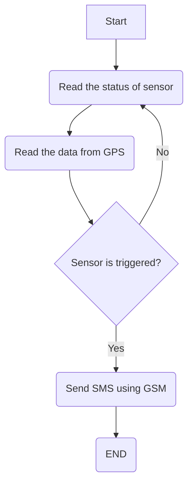
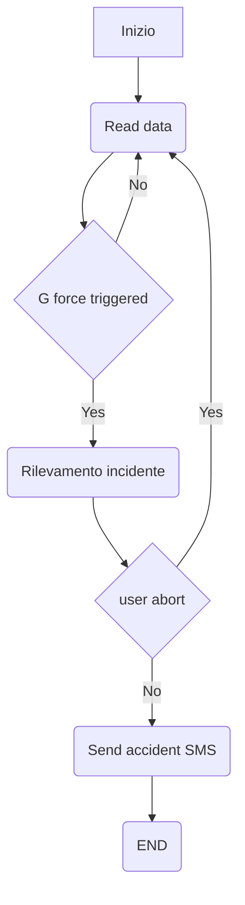

# Segnalazione allarmi

## Introduzione
Il meccanismo di segnalazione allarmi prevede tre diversi tipi di dinamiche:
- Assistenza incidente
- Assistenza cliente
- Avvertimento di alcuni sistemi non funzionanti / segnalazione di alcune situazioni anomale 

1) L'assistenza incidente tratta la dinamica relativa ad un incidente stradale, inviando le coordinate GPS ed un insieme di informazioni utili ad una stazione remota dell'autonoleggio, sarà proprio lei ad avvisare i soccorsi che poi andranno a recarsi nel preciso punto di impatto.
2) L'assistenza cliente include due semplici funzionalità: la prima di Sos dove il cliente si mette in contatto con un operatore dell'autonoleggio per qualsiasi necessità/bisogno, la seconda prevede la chiamata ad un carro attrezzi con il relativo invio di coordinate GPS.
3) Per concludere, l'ultima dinamica è quella più interessante che consiste nel rilevamento di alcuni malfunzionamenti del veicolo e di alcuni comportamenti non corretti da parte del cliente a bordo dell'autovettura. Di seguito approfondiremo quest'ultima dinamica in modo più dettagliato

## Piccola overview del sistema proposto
Per gestire le situazioni relative all'ultima dinamica, il sistema (black box) viene dotato di 3 LED (verdo, giallo, rosso) per indicare diversi tipi di situazioni e per suggerire al cliente il corretto comportamento da intraprendere nel caso dell'accensione di una spia (led) indicante una situazione di avvertimento/pericolo:
1. Led verde: il veicolo funziona correttamente e il comportamento del conducente è corretto.
2. Led giallo: indica un AVVERTIMENTO, se vengono rilevati problemi di poca rilevanza o eseguite azioni non lecite viene azionato il led; dopo un breve periodo ad esempio 1/2 giorni nel quale continua a persistere il problema o l'azione, viene avvertita la centrale operativa. Un esempio di azione non lecita è il divieto di fumo all'interno del veicolo, se viene rilevata una sola volta la presenza di fumo all'interno dell'abitacolo non viene avvisata la centrale; per cui il motto di questa spia è: se un problema di poca rilevanza o un'azione persistono, avverto la centrale operativa.
3. Led rosso: indica una situazione di PERICOLO, in questo caso la centrale operativa viene avvertita immediatamente.

Di seguito verranno proposte le dinamiche delle situazioni per le quali viene attivata una spia gialla piuttosto che una rossa:

__Situazioni azionamento led giallo:__
- Divieto di fumo all'interno dell'abitacolo per il mantenimento di un ambiente pulito e privo di odori sgradevoli per i successivi clienti. La presenza di fumo può essere rilevata da un sensore.
- Rilevamento guida su terreni non adatti: fuoristrada o percorsi non asfaltati sono vietati al conducente per evitare danni al veicolo. La presenza di terreni disconnessi può essere rilevata con l'accelerometro utilizzando l'asse verticale (z).
- Rilevamento guida su aree geografiche non percorribili: non posso recarmi ovunque con il veicolo della compagnia. La segnalazione di aree non percorribili può essere rilevata grazie al GPS.
- Rilevamento attività di trasporto/rimorchio: non posso trainare nulla con il veicolo a noleggio. E' possibile rilevare l'attività con alcuni parametri provenienti dalla rete CAN-BUS ad esempio carico motore e velocità.
- (?) Se la black box viene alimentata da una pila è necessario monitorarne la sua durata, se viene alimentata con la corrente della macchina non esiste alcun tipo di problema e può essere omessa questa casistica.

__Situazioni azionamento led rosso:__
- Distanza di frenata anomala: analizzando i dati di accelerazione e velocità del veicolo è possibile rilevare situazioni in cui la distanza di frenata è SIGNIFICATIVAMENTE più lunga, ciò può indicare un problema al sistema frenante o all'aderenza dei pneumatici. Si può rilevare tale situazione utilizzando i dati della rete CAN-BUS.
- Consumo anomalo di carburante: monitorando il consumo di carburante del veicolo e confrontandolo con i modelli di consumo attesi per determinate condizioni di guida (città, autostrada...) è possibile rilevare anomalie che potrebbero indicare perdite di carburante o problemi al motore, anche questa situazione può essere rilevata considerando i dati della rete CAN-BUS.
- Monitoraggio della qualità dell'aria nell'abitacolo: utilizzando sensori di qualità dell'aria il veicolo può rilevare la presenza di gas nocivi. Attività che può essere rilevata con lo stesso sensore utilizzato per rilevare i fumi.
- Rilevamento presenza di alcohol: non è consentito al conducente mettersi alla guida in stato di ebrezza. Questa attività può essere monitorata attraverso un sensore che rileva la presenza di etanolo/alcohol nell'ambiente. Punto debole: non è possibile trasportare sul sedile del passeggero qualcuno che abbia bevuto. Ho pensato che se si potesse leggere in qualche modo il valore di pressione esercitata sul sedile del passeggero (True/False) si potrebbe ovviare al problema sopra citato chiedendo al guidatore se è coscente di trasportare un passeggero in stato di ebrezza, utilizzando quindi una modalità di conferma.
__Di seguito alcune situazioni meno interessanti, ma comunque rilevanti per la sicurezza:__
- Temperatura anomala del motore: il motore non lavora nel suo range di temperatura e potrebbe guastarsi. Sensoristica: CAN-BUS.
- Temperatura refrigerante: la temperatura del liquido di raffreddamento del motore, solitamente espressa in gradi Celsius può essere critica. Sensoristica: CAN-BUS.
- Coppia motore "torque": mantenere la coppia del motore entro limiti ottimali è essenziale per garantire prestazioni efficienti e sicure del veicolo, prevenendo l'usura prematura del motore e della trasmissione. Se la coppia è troppo bassa, si rischia una scarsa accelerazione; se troppo alta, si può verificare un eccessivo consumo di carburante e possibili danni meccanici.
Sensoristica: CAN-BUS.

## Configurazione
### - Assistenza incidente
Sostanzialmente il meccanismo si divide in due fasi: la fase di RILEVAMENTO e quella di NOTIFICA.



__Accelerometro__: nella fase di rilevamento l'accelerometro continua ad estrarre informazioni relative alla forza G (forza di accelerazione) sperimentata dagli occupanti.
__GPS__: nella fase di notifica è utile per inviare le coordinate GPS alla stazione remota.
__VELOCITA' VEICOLO__: nella fase di notifica viene mandata alla stazione remota e può essere usata per future ricostruzioni/analisi dell'incidente.

Per il rilevamento di una situazione di incidente posso usare un accelerometro, in un evento del genere la black box subirà la stessa accelerazione degli occupanti del veicolo. La forza G che si ricava dall'accelerazione deve essere ragionevolmente alta per un incidente, per questo non vengono considerati incidenti se tutte le accelerazioni sono inferiori a 4/5G. Infatti sulle auto gli airbag non vengono altro che azionati dal superamento di una certa soglia di accelerazione.
Come secondo filtro viene utilizzato un sistema di conferma per evitare i falsi positivi, all'utente vengono concessi 30 secondi per annullare il rilevamento della situazione di incidente, terminati i 30sec la chiamata partirà in automatico, in caso di annullamento si ritornerà ad una situazione di partenza



```sh
Incidente = I
Accident_threshold  = 1
I = 1 se ((Accelerazione/4G) >= (Accident_threshold)) && !userAbort
I = 0 altrimenti
```

A seguito dell'incidente le informazioni che possono essere trasportate sono: **G-force** per capire quanto effettivamente è stato forte l'impatto, la **velocità del veicolo** per capire a quanto stava andando, le coordinate GPS **latitudine** e **longitudine** per capire dove è avvenuto l'incidente e in che **momento** è avvenuto (time).

Punto di debolezza: in caso di incidente estremo se la black box viene distrutta non è possibile contattare i soccorsi.
### - Assistenza cliente
Utilizzo di un bottone per gestire sia Sos che la chiamata al carro attrezzi, premendo il bottone per una durata di 5 sec mi metto in contatto con la centrale operativa, premendolo invece per 10 sec mi metto in contatto con il carro attrezzi (+ invio coordinate GPS).
### - Avvertimento di alcuni sistemi non funzionanti / segnalazione di alcune situazioni anomale
Per ogni casistica utilizzo opportuni sensori per catturare i possibili problemi del veicolo o comportamenti scorretti del cliente:
comportamento/problema : sensore di rilevamento
- Fumo : rilevatore di fumi
- Guida in fuoristrada : accelerometro
- Guida fuori dal range permesso : GPS
- Rimorchio/traino : dati CAN-BUS
- Distanza di frenata anomala : dati CAN-BUS
- Consumo anomalo di carburante : dati CAN-BUS
- Monitoraggio qualità aria abitacolo : rilevatore gas
- Rilevamento presenza di alcohol nell'abitacolo : rilevatore etanolo/alcohol
- Temperatura motore : dati CAN-BUS
- Temperatura refrigerante : dati CAN-BUS
- Pressione collettore di entrata : dati CAN-BUS
- Temperatura aria di entrata del collettore : dati CAN-BUS
- Rilevamento pressione olio motore : dati CAN-BUS

## Feedback del corretto funzionamento
Per verificare il corretto funzionamento delle casistiche che coinvolgono i dati provvenienti dalla rete CAN-BUS è necessario modificarne i valori degli attributi coinvolti, simulando così tutti i possibili scenari e verificare che il sistema reagisca in modo appropriato. Per quanto riguarga il coinvolgimento dei vari sensori è opportuno simulare tutte le varie situazioni possibili e verificare anche in questo caso che il sistema reagisca coerentemente con il funzionamento atteso.
