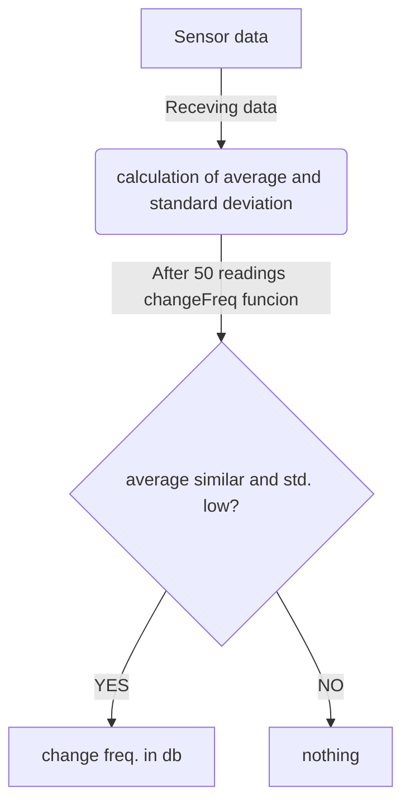

# Struttura interna del db per la gestione dei dati raccolti 
_Numeri bassi indicano priorità alta_

### Tabella principale di memorizzazione dati (sensori/can bus):
|nome_sensore|valore|timestamp|sincronizzato|priorità 
|:---:|:---:|:---:|:---:|:---:| 
|TEXT|REAL|INTEGER (numero di secondi trascorsi dall'epoc)|INTEGER (boolean)|INTEGER
|Temperatura liquido refrigerante|98 (°C)|1715786497|0 (false) | 8
|Carico motore|47 (%) |1715269497| 1 (true)| 3

### Tabella frequenze di campionamento:
|nome_sensore|frequenza|variabile
|:---:|:---:|:---:
|TEXT|INTEGER (espressa in secondi) |INTEGER (boolean)
|Temperatura liquido refrigerante|60|1|3
|Carico motore|45|0|0

### Tabella dati statistici:
|nome_sensore|data (YYYY/MM/GG)|media|mediana|moda|dev.std.|vMin|vMax 
|:---:|:---:|:---:|:---:|:---:|:---:|:---:|:---:| 
|Text|INTEGER|REAL|REAL|REAL|REAL|REAL|REAL
|Temperatura liquido refrigerante|2024/05/15|120,4|115,8|109|110|45|150
|Carico motore|2024/05/15|60|56|56|59|0|99

## Meccanismo di cambio frequenza

