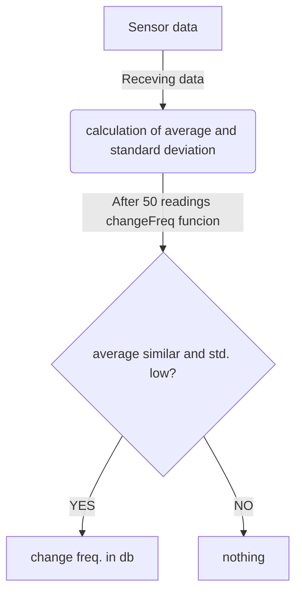

# Struttura interna del db per la gestione dei dati raccolti 
_Numeri bassi indicano priorità alta_

### Tabella principale di memorizzazione dati (sensori/can bus):
|nome_sensore|valore|timestamp|sincronizzato|priorità 
|:---:|:---:|:---:|:---:|:---:| 
|TEXT|REAL|INTEGER (numero di secondi trascorsi dall'epoc)|INTEGER (boolean)|INTEGER
|Temperatura liquido refrigerante|98 (°C)|1715786497|0 (false) | 8
|Carico motore|47 (%) |1715269497| 1 (true)| 3

### Tabella frequenze di campionamento:
|nome_sensore|frequenza|variabile
|:---:|:---:|:---:
|TEXT|INTEGER (espressa in secondi) |INTEGER (boolean)
|Temperatura liquido refrigerante|60|1|3
|Carico motore|45|0|0

### Tabella dati statistici:
|nome_sensore|data (YYYY/MM/GG)|media|mediana|moda|dev.std.|vMin|vMax|sincornizzato
|:---:|:---:|:---:|:---:|:---:|:---:|:---:|:---:|:--:
|Text|INTEGER|REAL|REAL|REAL|REAL|REAL|REAL|INTEGER (boolean)
|Temperatura liquido refrigerante|2024/05/15|120,4|115,8|109|110|45|150|0
|Carico motore|2024/05/15|60|56|56|59|0|99|1

## Meccanismo di cambio frequenza

## Pulizia dati: simulo ciò che fa il garbage collection

### G1 (dedicato alla tabella principale di memorizzazione dati): 
- task che passa ogni tot tempo (8h) e pulisce i record già sincronizzati
- task che viene chiamato se la memoria del mio db supera una certa soglia 80/90%. Reagisco eleiminando metà dei record presenti nel db (i più datati)
### G2 (dedicato alla tabella contenente i dati statistici):
- uguale al primo task di G1
- dopo il superamento di una soglia 7gg ad esempio elimina metà dei record più vecchi ancora non sincronizzati

Considerazioni generali sulla black:

### Tracking: 
- Coord GPS: (sms) + store db
### Seganalazione allarmi:
- Assistenza incidente: (sms)
- Assistenza cliente: (sms)
- Avvertimento di alcuni sistemi non funzionanti/segnalazione di alcune anomalie: store db, naturalmente alcuni task avranno priorità più alta rispetto ad altri 
### Profilazione guida:
- store db

#### Domande:
- GPS_LONG / GPS_LAT
- Gestione memoria (sqlite3.h)
- Synch step finale mancante
