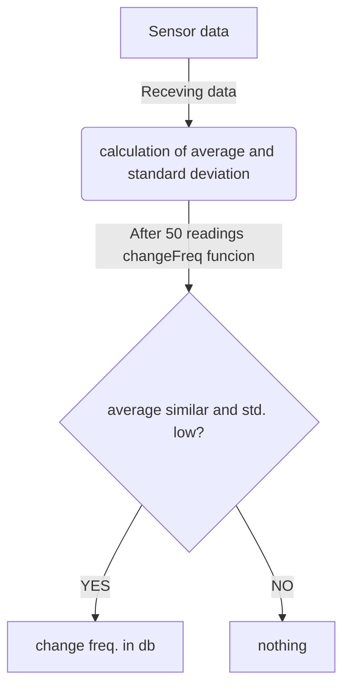

# Struttura interna del db per la gestione dei dati raccolti 
_Numeri bassi indicano priorità alta_

### Tabella principale di memorizzazione dati (sensori/can bus):
|nome_sensore|valore_generico|tipo_di_dato|unità_di_misura|timestamp|sincronizzato|priorità 
|:---:|:---:|:---:|:---:|:---:| :---:|:---:
|TEXT|TEXT|TEXT|TEXT|INTEGER (numero di secondi trascorsi dall'epoc)|INTEGER (boolean)|INTEGER
|"Temperatura liquido refrigerante"|"98.6"|"Float"|"°C"|1715786497|0|8
|"Carico motore"|"47"|"Integer"|"%"|1715269497|1|3

### Tabella tempi di campionamento:
|nome_sensore|tempo|variabile
|:---:|:---:|:---:
|TEXT|INTEGER (espressa in secondi) |INTEGER (boolean)
|"Temperatura liquido refrigerante"|60|1
|"Carico motore"|45|0

### Tabella dati statistici:
|nome_sensore|data (YYYY/MM/GG)|media|mediana|moda|dev.std.|vMin|vMax|sincornizzato
|:---:|:---:|:---:|:---:|:---:|:---:|:---:|:---:|:--:
|Text|INTEGER|REAL|REAL|REAL|REAL|REAL|REAL|INTEGER (boolean)
|"Temperatura liquido refrigerante"|2024/05/15|120.4|115.8|109|110|45|150|0
|"Carico motore"|2024/05/15|60|56|56|59|0|99|1

## Meccanismo di cambio frequenza

## Pulizia dati: simulo ciò che fa il garbage collection

### Garbage collection: 
- task che passa ogni tot tempo (8h) e pulisce i record già sincronizzati presenti nella tabella di storage principale e nella tabella statistica
- task che viene chiamato se la memoria del mio db supera una certa soglia 80/90%. Reagisco eleiminando metà dei record presenti nel db (i più datati)

## Considerazioni generali sulla black:

### Tracking: 
- Coord GPS: (sms) + store db
### Seganalazione allarmi:
- Assistenza incidente: (sms)
- Assistenza cliente: (sms)
- Avvertimento di alcuni sistemi non funzionanti/segnalazione di alcune anomalie: store db, naturalmente alcuni task avranno priorità più alta rispetto ad altri 
### Profilazione guida:
- store db
