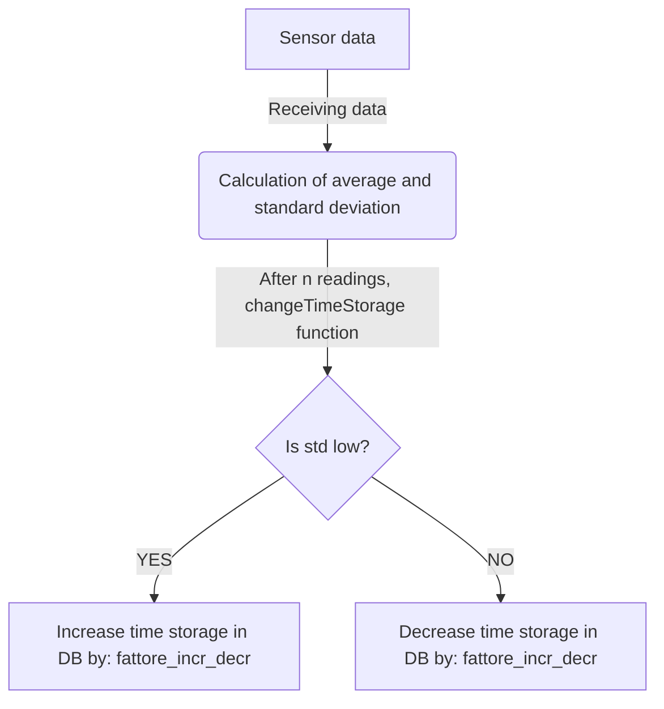

# Struttura interna del db per la gestione dei dati raccolti 
_Numeri alti indicano priorità alta_

### Tabella principale di memorizzazione dati (sensori/can bus) T1:
|nome_sensore|valore|tipo_dato|unita_misura|timestamp|synchronised|priority
|:---:|:---:|:---:|:---:|:---:| :---:|:---:
|TEXT|TEXT|TEXT|TEXT|INTEGER (numero di secondi trascorsi dall'epoc)|INTEGER (boolean)|INTEGER
|"Liquido raffreddamento"|"98"|"Integer"|"°C"|1715786497|0|3
|"Voltaggio batteria"|"12.3"|"Float"|"Volt (V)"|1715269497|1|8

### Tabella tempo di campionamento T2:
|nome_sensore|tempo_storage (ogni quanto memorizzare il valore)|variabile (indica se il tempo di storage può cambiare)|fattore_incr_decr (di quanto aumentare o diminuire il tempo di storage)|soglia (delimita se i dati campionati sono omogenei "<" o eterogenei ">")|tMinStorage (tempo minimo di storage)|tMaxStorage (tempo massimo di storage)
|:---:|:---:|:---:|:---:|:---:|:---:|:---:|
|TEXT|INTEGER (espressa in secondi) |INTEGER (boolean)|INTEGER|INTEGER|INTEGER|INTEGER|
|"Olio motore temp"|45|1|15|0.25|45|600
|"Coordinate GPS"|30|0|NULL|NULL|NULL|NULL

### Tabella profilazione guida T3:
|data (YYYY-MM-GG HH:MM:SS, data in cui il voto è stato registrato)|voto|lastStorage (momento in cui è stato memorizzato il voto "in secondi") |synchronised
|:---:|:---:|:---:|:---:|
|TEXT|TEXT|INTEGER|INTEGER (boolean)|
|"2024-03-10 12:00:00"|0.99|1715786497|1|
|"2024-07-07 17:56:20"|0.53|1815786497|0|

### Tabella allarmi critici T4:
|problema|data (YYYY-MM-GG HH:MM:SS)|synchronised|
|:---:|:---:|:---:|
|TEXT|TEXT|INTEGER (boolean)|
|"Alcool"|"2024-07-07 17:56:20"|1715786497|1|
|"Gas nell'abitacolo"|"2024-07-11 17:56:20"|1815786497|0|

### Tabella allarmi meno critici T5:
|problema|rilevamenti|soglia (il numero max di rilevamenti)|daMandare|synchronised
|:---:|:---:|:---:|:---:|:---:|
|TEXT|INTEGER|INTEGER|INTEGER (boolean)|INTEGER (boolean)|
|"Fumo"|3|3|1|0|
|"Fuori range GPS"|0|5|0|0|

## Meccanismo cambio tempo di storage

Logica: se dopo una serie di letture (n ad esempio) i dati hanno una bassa deviazione standard, ovvero sono molto simili tra di loro, memorizzo i dati del veicolo con una frequenza minore, aumentando il tempo di storage di un certo fattore (presente nella seconda tabella di questo file); se la deviazione standard è alta, significa che i dati sono abbastanza differenti tra di loro e li monitoro con una frequenza maggiore. Naturalmente vengono posti dei lower e upper bound per il tempo di memorizzazione entro i quali il tempo stesso può variare
